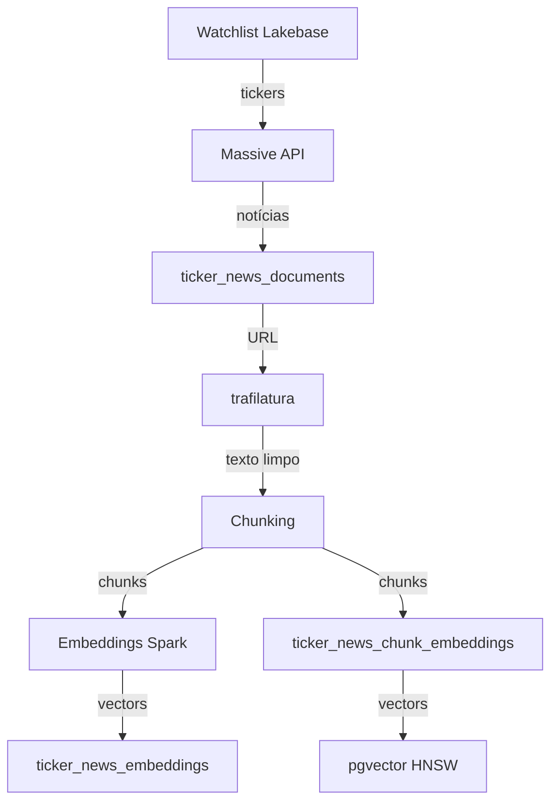

# 📊 Pipeline de Dados

Detalhes do pipeline de ingestão e processamento.

## Etapas do Pipeline

## Schema das Tabelas

### ticker_news_documents

| Coluna | Tipo | Descrição |
|--------|------|-----------|
| id | TEXT | ID da notícia |
| ticker | TEXT | Símbolo da ação |
| title | TEXT | Título da notícia |
| description | TEXT | Resumo |
| author | TEXT | Autor |
| article_url | TEXT | URL original |
| published_utc | TIMESTAMPTZ | Data de publicação |
| payload | JSONB | Payload original |
| synced_at | TIMESTAMPTZ | Hora de sincronização |

### ticker_news_embeddings

| Coluna | Tipo | Descrição |
|--------|------|-----------|
| id | SERIAL | ID auto-incremento |
| ticker | TEXT | Símbolo |
| title | TEXT | Título |
| published_utc | TIMESTAMPTZ | Data |
| embedding | VECTOR | Vector (384 dims) |
| model_name | TEXT | Nome do modelo |
| embedded_at | TIMESTAMPTZ | Hora de embedding |

### ticker_news_chunk_embeddings

| Coluna | Tipo | Descrição |
|--------|------|-----------|
| id | SERIAL | ID auto-incremento |
| document_id | INTEGER | FK para documents |
| chunk_index | INTEGER | Índice do chunk |
| chunk_text | TEXT | Texto do chunk |
| embedding | VECTOR | Vector (384 dims) |
| model_name | TEXT | Nome do modelo |
| embedded_at | TIMESTAMPTZ | Hora de embedding |

## Idempotência

| Tabela | Strategy | Chave |
|--------|----------|-------|
| ticker_news_documents | UPSERT | id (artigo único) |
| ticker_news_embeddings | UPSERT | id + model_name |
| ticker_news_chunk_embeddings | UPSERT | document_id + chunk_index |

## Performance

- **Embedding:** Batch ~100 artigos em paralelo Spark
- **Query RAG:** < 500ms com HNSW index
- **Throughput API:** Rate limited (10 req/min)
