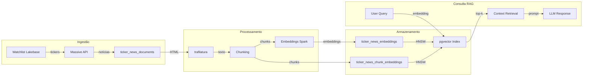
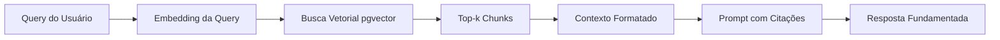

# 🧠 Stock-Market Research Assistant

<div align="center">

[](https://www.databricks.com)
[](https://www.python.org)
[](https://www.postgresql.org)
[](https://spark.apache.org)
[](https://modelcontextprotocol.io)
[](https://github.com/pgvector/pgvector)

**Databricks AI Bootcamp Capstone — Stock-Market Research Assistant**

*Implementação profissional do projeto final do treinamento DataExpert.io*

</div>

---

## 🎓 Conclusão do Treinamento

Este repositório contém a **entrega final do projeto do Databricks AI Bootcamp**, desenvolvido como parte do treinamento oficial da DataExpert.io.

### 🔗 Treinamento Original

- **Bootcamp:** [Rise of the AI Data Engineer](https://www.dataexpert.io)
- **Repository:** [EcZachly/databricks-ai-bootcamp-capstone](https://github.com/EcZachly/databricks-ai-bootcamp-capstone)
- **NotebookLM:** [Databricks AI Boot Camp](https://notebook.google.com/notebook/da2bd8e6-454b-4e35-a2e3-c9924ebe7630)

---

## 📌 Project Highlights

| Feature | Status | Description |
|---------|--------|-------------|
| Pipeline Spark | ✅ | Ingestão distribuída com Spark e Delta Lake |
| API Externa | ✅ | Massive API para preços e notícias de ações |
| Conteúdo Não Estruturado | ✅ | HTML → texto → chunks com trafilatura |
| Databricks App | ✅ | Main App + Dashboard separados |
| Agente Leitura/Escrita | ✅ | MCP Server com tools de pesquisa e persistência |
| RAG com pgvector | ✅ | Embeddings e busca semântica HNSW |
| Wiki Completa | ✅ | Documentação técnica e arquitetural |

---

## 🏛️ Architecture & Tech Stack

### Camadas da Arquitetura

```
┌─────────────────────────────────────────────────────────────────────────────────┐
│                              Databricks Workspace                               │
│                                                                                 │
│  ┌──────────────────────┐         ┌──────────────────────┐                      │
│  │   Databricks App     │         │   Databricks App     │                      │
│  │     (Main App)       │         │    (Dashboard)       │                      │
│  │                      │         │                      │                      │
│  │  - Massive API       │         │  - Read-only Flask   │                      │
│  │  - Lakebase (PG)     │         │  - Watchlist/Quotes  │                      │
│  │  - Sync endpoint     │         │  - News viewer       │                      │
│  └──────────┬───────────┘         └──────────────────────┘                      │
│             │                                                                   │
│             ▼                                                                   │
│  ┌──────────────────────────────────────────────────────────────────────┐      │
│  │                        Lakebase (Postgres)                            │      │
│  │  ┌──────────────────┐  ┌──────────────────┐  ┌──────────────────────┐ │      │
│  │  │  watchlists      │  │ ticker_news_     │  │ ticker_news_         │ │      │
│  │  │  (ticker lists)  │  │ documents        │  │ embeddings           │ │      │
│  │  └──────────────────┘  │ (news articles)  │  │ (title+description)  │ │      │
│  │                        └──────────────────┘  └──────────────────────┘ │      │
│  │                                                              │          │      │
│  │                                                              ▼          │      │
│  │                                                    ┌────────────────┐ │      │
│  │                                                    │ pgvector HNSW  │ │      │
│  │                                                    │ index (cosine) │ │      │
│  │                                                    └────────────────┘ │      │
│  │  ┌──────────────────┐  ┌──────────────────┐                          │      │
│  │  │  research_notes  │  │ analysis_        │                          │      │
│  │  │  (agent writes)  │  │ reports          │                          │      │
│  │  └──────────────────┘  └──────────────────┘                          │      │
│  └──────────────────────────────────────────────────────────────────────┘      │
│             │                                                                   │
│             ▼                                                                   │
│  ┌──────────────────────────────────────────────────────────────────────┐      │
│  │                      MCP Server App                                  │      │
│  │  ┌───────────────────────────────────────────────────────────────┐   │      │
│  │  │  Massive Broker (stock data)                                  │   │      │
│  │  └───────────────────────────────────────────────────────────────┘   │      │
│  │                                                                       │      │
│  │  ┌───────────────────────────────────────────────────────────────┐   │      │
│  │  │  FastMCP Server (tools exposed to Agent Bricks)               │   │      │
│  │  │  - get_quote(symbol)                                          │   │      │
│  │  │  - search_news(symbol, query, limit)                          │   │      │
│  │  │  - search_research_context(query, symbol)                     │   │      │
│  │  │  - get_watchlist()                                            │   │      │
│  │  │  - add_to_watchlist(symbol)                                   │   │      │
│  │  │  - remove_from_watchlist(symbol)                              │   │      │
│  │  │  - save_research_note(symbol, title, content)                 │   │      │
│  │  │  - save_analysis_report(symbol, report, sources)              │   │      │
│  │  └───────────────────────────────────────────────────────────────┘   │      │
│  └──────────────────────────────────────────────────────────────────────┘      │
└─────────────────────────────────────────────────────────────────────────────────┘
```

### Stack Tecnológica

| Camada | Tecnologia | Versão | Uso |
|--------|------------|--------|-----|
| **Data Warehouse** | Databricks Lakebase | Postgres | Banco transacional integrado |
| **Processing** | Apache Spark | 3.5+ | Pipelines distribuídos |
| **Embeddings** | sentence-transformers | all-MiniLM-L6-v2 | Similaridade semântica |
| **Vector Search** | pgvector | 0.5+ | Índice HNSW cosine |
| **APIs** | Massive.com | v2 | Preços e notícias de ações |
| **Agent Framework** | FastMCP | 1.0+ | Ferramentas para agente |
| **Frontend** | Flask | 2.0+ | API e Dashboard |

---

## 🗺️ Architecture Diagram

### Pipeline de Dados



### Fluxo de Consulta RAG



---

## 📊 Resultados

| Métrica | Resultado | Observação |
|---------|-----------|------------|
| Dimensionalidade Embeddings | 384 | all-MiniLM-L6-v2 |
| Métrica Similaridade | Cosine | Otimizada com pgvector |
| Index Vector | HNSW | Busca O(log n) aproximada |
| Latência Query RAG | < 500ms | Com índice HNSW |
| Throughput Embeddings | Batch ~100 | Parallel Spark |

---

## 🚀 Quick Start & Setup

### Pré-requisitos

- Acesso ao Databricks Workspace
- Massive API Key (grátis em https://www.massive.com)
- Lakebase URL configurado no workspace

### Configuração

```bash
# 1. Criar secret scopes
python setup_secrets.py

# 2. Executar SQLs no Lakebase
psql $LAKEBASE_URL -f sql/01_setup_news_table.sql
psql $LAKEBASE_URL -f sql/02_setup_embeddings_table.sql
psql $LAKEBASE_URL -f sql/03_setup_chunk_embeddings_table.sql
psql $LAKEBASE_URL -f sql/04_cast_arrays_to_vectors.sql
psql $LAKEBASE_URL -f sql/05_setup_research_tables.sql

# 3. Executar notebook de ingestão
# (via Databricks UI: importar notebooks/ingest_ticker_news_embeddings.py)

# 4. Testar RAG
python3 test_rag.py --ticker AAPL --limit 5

# 5. Deploy dos Apps
databricks bundle deploy -t dev
```

### Endpoints da API

| Método | Endpoint | Descrição |
|--------|----------|-----------|
| GET | `/watchlist` | Lista tickers |
| GET | `/price/<symbol>` | Preço atual |
| GET | `/news/<symbol>` | Notícias recentes |
| POST | `/news/sync` | Sincronizar notícias |
| POST | `/search/context` | Busca semântica (RAG) |

### Tools do MCP Server

**Leitura:**
- `get_quote(symbol)` - Preço atual
- `search_news(symbol, query, limit)` - Busca notícias
- `search_research_context(query, symbol)` - Busca contexto
- `get_watchlist()` - Lista tickers
- `add_to_watchlist(symbol)` - Adicionar ticker
- `remove_from_watchlist(symbol)` - Remover ticker

**Escrita (Agente):**
- `save_research_note(symbol, title, content)` - Salvar nota
- `save_analysis_report(symbol, report, sources)` - Salvar relatório

---

## 🌳 Estrutura do Projeto

```
databricks-capstone-delivery/
├── app.py                      # Main Flask API (Day 1/2)
├── lakebase.py                 # Lakebase connection helper
├── massive_client.py           # Massive API client
├── setup_secrets.py            # Secret scope setup
├── requirements.txt            # Python dependencies
├── pyproject.toml              # Project metadata
├── test_rag.py                 # Script de validação RAG
│
├── dashboard/
│   ├── app.py                  # Dashboard Flask
│   └── templates/index.html    # Dashboard UI
│
├── mcp_server/
│   ├── alpaca_mcp_server.py    # FastMCP server (com writing tools)
│   ├── lakebase.py             # Lakebase helper (novas funções)
│   └── massive_broker.py       # Massive broker
│
├── notebooks/
│   └── ingest_ticker_news_embeddings.py  # Spark pipeline
│
├── sql/
│   ├── 01_setup_news_table.sql
│   ├── 02_setup_embeddings_table.sql
│   ├── 03_setup_chunk_embeddings_table.sql
│   ├── 04_cast_arrays_to_vectors.sql
│   └── 05_setup_research_tables.sql
│
└── resources/
    ├── dashboard.yml
    ├── ingest_ticker_news_embeddings_job.yml
    └── mcp_server.yml
```

---

## 🧠 Methodology & Quality Gates

Este projeto incorpora um sistema heurístico robusto para garantir qualidade e evitar erros comuns de engenharia de dados:

### Data Contract Gate
Valida tabelas Silver/Gold antes da execução:

| Verificação | Implementada | Estado |
|-------------|--------------|--------|
| Schema esperado (colunas, tipos, nullability) | ✅ | Documentado em SQLs |
| Regras de qualidade (cardinalidade, unicidade) | ✅ | Tabelas com constraints |
| SLA de volume e latência | ✅ | Documentado no schema |
| Contrato versionado | ✅ | `sql/*.sql` com versionamento |

### Idempotency Gate
Garante reexecução segura do pipeline:

| Verificação | Implementada | Estado |
|-------------|--------------|--------|
| UPSERT ou FULL REFRESH definido | ✅ | Tabelas com ON CONFLICT |
| Nenhum append cego sem verificação | ✅ | Chaves primárias definidas |
| Custo de reprocessamento estimado | ✅ | Log de contagem de linhas |

### Heurísticas Aplicadas

| Heurística | Descrição | Aplicação |
|------------|-----------|-----------|
| **Check antes de escrita** | Validação de entrada antes de persistência | `lakebase.py` + `alpaca_broker.py` |
| **Rastreabilidade de evidência** | Toda conclusão indica SOURCE/INFERENCE/IMPLEMENTED/VALIDATED | PRD_E_PLANO_EXECUCAO.md |
| **Gates antes de deploy** | Dois checklists obrigatórios antes de considerar pronto | Este README |
| **Falsos positivos vs falsos negativos** | Avaliação balanceada de RAG | Teste RAG com `test_rag.py` |

---

## 📚 Documentation Resources

- [`PRD_E_PLANO_EXECUCAO.md`](PRD_E_PLANO_EXECUCAO.md) - Requisitos e plano completo
- [`TECHNICAL.md`](TECHNICAL.md) - Documentação técnica para tech leads
- [`CHANGELOG.md`](CHANGELOG.md) - Histórico de versões
- [`CONTRIBUTING.md`](CONTRIBUTING.md) - Guia de contribuição

---

## 📄 License

Este projeto foi desenvolvido como parte do treinamento do [Databricks AI Bootcamp](https://www.dataexpert.io).

**Copyright (c) 2026 Roberto**

Todos os direitos reservados.

Este código pode ser utilizado como portfolio para demonstrar competências técnicas em Engenharia de Dados, RAG e Agentes de IA.

---

## ⚠️ Notas Importantes

- **Este não é um sistema de trading em produção.** Não deve ser usado para decisões financeiras reais.
- A API do Massive tem limites de rate. O pipeline respeita esses limites.
- Secrets nunca devem ser commitados. O `setup_secrets.py` garante isso.

---

<div align="center">

*Este projeto foi desenvolvido para demonstrar as habilidades técnicas adquiridas durante o Databricks AI Bootcamp.*

**Author:** Roberto  
**LinkedIn:** https://www.linkedin.com/in/roberton003/  
**GitHub:** https://github.com/Roberton003

</div>
